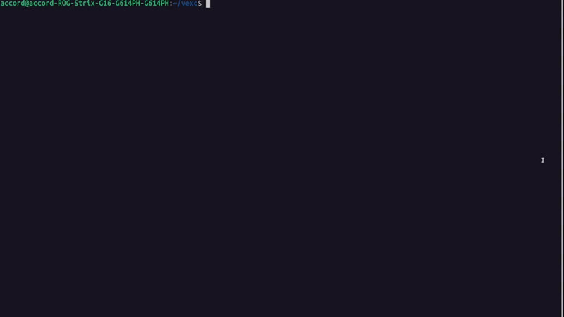

# VexC

**Please note: [Work in Progress] The current project is being actively worked on.** 

`vexc` is a small compiler for Vex, a minimal statically typed language built to experiment with compiler front-end (with custom lexing, parsing, semantic anlysis), SSA IR, optimization, and LLVM lowering.

## Current Progress

What is already working:

- Lexer
- Parser
- Semantic analysis with type annotations on the AST
- Immediate LLVM IR generation and execution
- Custom SSA-style VexIR generation
- CFG construction with `BLOCK`, `BRANCH`, `JUMP`, and `PHI`
- A first restricted SLP-style vectorization pass on straight-line code
- Raw vs optimized VexIR inspection from the CLI

## Visuals

A visual of [examples/test1.vx](examples/test1.vx) which demonstrates the lexing, parsing, semantics, and LLVM lowering:

<p align="center">
  
</p>

A visual of [examples/test2.vx](examples/test2.vx) which demonstrates the entire pipeline, as well as emitted raw VexIR and vectorized VexIR:

<p align="center">
  
</p>

## Pipeline

Current stages:

- Lexing
- Parsing
- Semantic analysis
- Immediate LLVM path
- Raw SSA VexIR generation
- Optimized SSA VexIR generation

## Build

```bash
/path/to/cmake -S . -B cmake-build-debug
/path/to/cmake --build cmake-build-debug
```

## Run

Run one of the examples:

```bash
./cmake-build-debug/vexc --immediate-run examples/test1.vx
```

Useful flags:

- `--tokens` prints lexer output
- `--ast` prints the parsed AST
- `--semantics` prints the typed AST after semantic analysis
- `--immediate-llvm` prints the immediate LLVM IR path
- `--immediate-run` JITs and runs through the immediate backend
- `--emit-raw-ir` prints generated SSA VexIR before vectorization
- `--emit-ir` prints optimized SSA VexIR after vectorization
- `--extra-verbose` prints every intermediate stage

## Examples

- [examples/simple_test1.vx](examples/simple_test1.vx) - hello world
- [examples/simple_test2.vx](examples/simple_test2.vx) - operators
- [examples/simple_test3.vx](examples/simple_test3.vx) - loops and conditionals
- [examples/simple_test4.vx](examples/simple_test4.vx) - recursive Fibonacci
- [examples/lexer_error_test1.vx](examples/lexer_error_test1.vx) - lexer failure cases

## Layout

- [src](src) - compiler implementation
- [include](include) - headers
- [examples](examples) - sample Vex programs
- [docs](docs) - syntax notes, IR notes, and error codes

## Notes

- See [docs/syntax.md](docs/syntax.md) for the current Vex language syntax
- See [docs/IR syntax.md](docs/IR%20syntax.md) for the current VexIR shape
- See [docs/error_codes.md](docs/error_codes.md) for compiler exit codes
